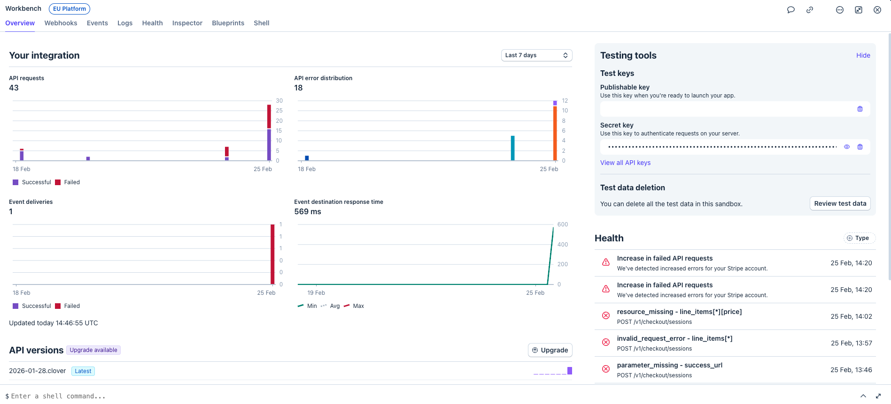
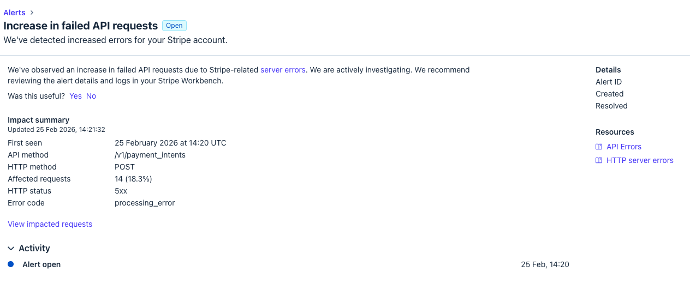
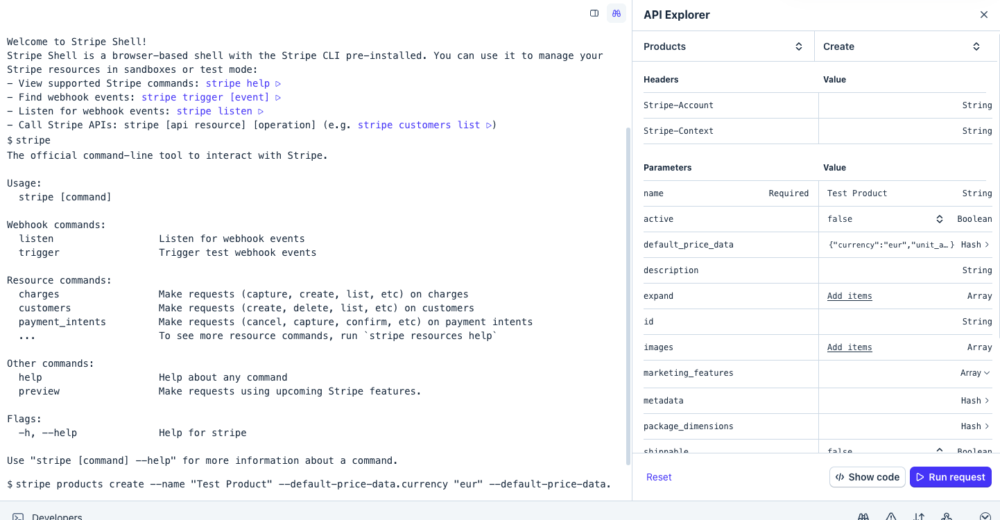
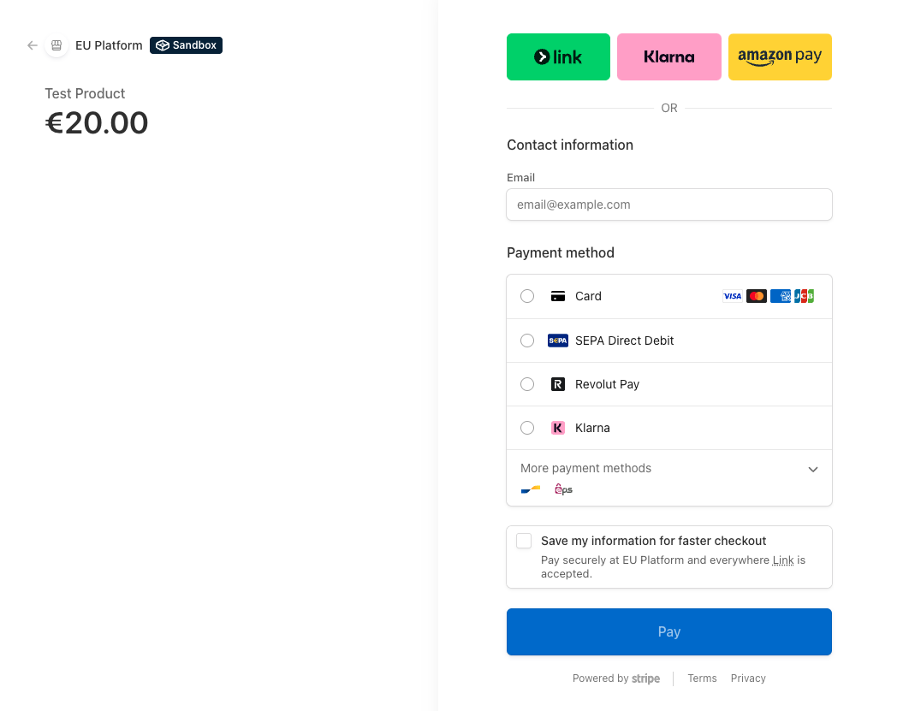
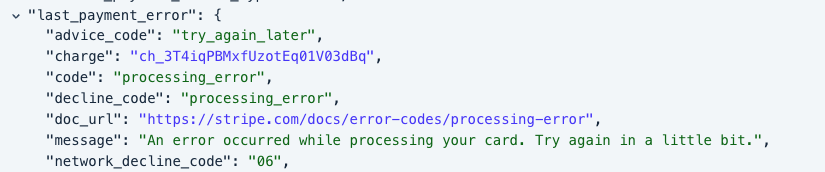
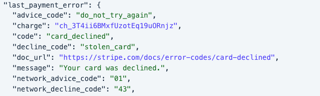
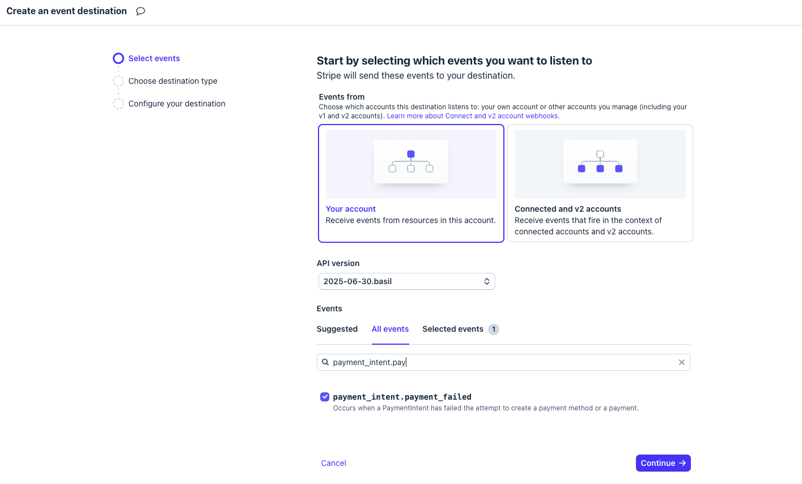
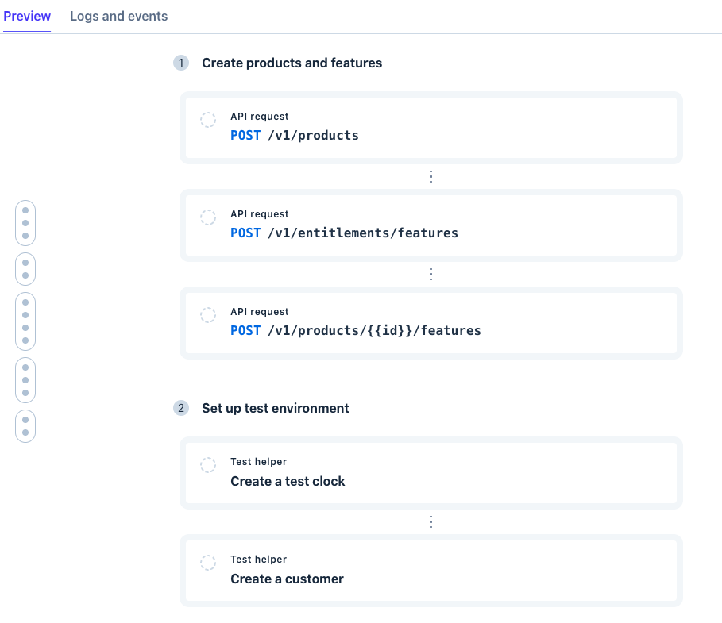

# Developer Workshop: Workbench

**Objective:** Learn how to debug, inspect, and troubleshoot Stripe integrations using Workbench in a sandbox environment.

Workbench is a developer tool built into the Stripe Dashboard that helps you debug, manage, and grow your Stripe integration. You can:

- Test API calls interactively with the **Shell** or **API Explorer**
- Inspect API objects in JSON
- Explore logs of all requests and responses
- Monitor webhook deliveries
- Identify hidden errors and integration issues

---

## Scenario

Imagine your team has received a **health alert**: there's an increase in failed payments. You need to investigate what's happening behind the scenes—without relying on customer complaints.

1. **Open Workbench** via the **Developer** menu.

  

2. **In real scenarios, you may receive and review the health alert** — it signals a potential problem with your integration (e.g. a spike in failed payments) and helps you detect backend issues before they impact customers. See more under the **Health** tab.

  

**Goal for this workshop:** Simulate payments that result in errors so you can understand how Workbench's toolset can be used to investigate, diagnose, and fix issues.

---

## Step 1: Open Stripe Shell

1. **Open Workbench** and toggle the Shell using the **`~`** key.
2. **Familiarise yourself with the Shell** — it lets you experiment in a sandbox and interact with API endpoints without touching production. You'll see commands like `products`, `checkout sessions`, and `payment_intents`.
3. **Use the API Explorer** (panel on the right) to tweak parameters interactively. Think of this as your dev sandbox inside Stripe—no code changes needed.
4. **Run** the following to see available commands:

```bash
stripe
```

---

## Step 2: Create a Product with a Price

1. **Call the Product API** to create a product and price:

```bash
stripe products create \
  --name "Test Product" \
  --default-price-data.currency "eur" \
  --default-price-data.unit-amount "2000"
```

2. **Observe the API Explorer** — as you type the call, the panel on the right populates the parameters. You can tweak parameters in a tabular format without editing JSON manually.

  

3. **Inspect the result** in Workbench's **Inspector**: open the product object in JSON, drill into objects, and explore their relationships.
4. **Note the hierarchy:** Product → Price → IDs.

---

## Step 3: Create a Checkout Session

1. **Get the price ID** from the response body of your create product call (Step 2).
2. **Create a Checkout session** by calling the Checkout Sessions API:

```bash
stripe checkout sessions create \
  -d "line_items[0][price]"=price_xxxxx \
  -d "line_items[0][quantity]"=1 \
  --mode=payment \
  --success-url="https://dashboard.stripe.com/workbench/blueprints/one-time-payment/checkout-chapter?confirmation-redirect=create-checkout-session" \
  --cancel-url="https://dashboard.stripe.com/workbench/blueprints/one-time-payment/checkout-chapter?confirmation-redirect=create-checkout-session"
```

3. **Replace** `price_xxxxx` with your actual price ID.
4. **Use the response:** the call returns a hosted Checkout page URL for sandbox payments. Behind the scenes it creates **PaymentIntent**, **Customer**, and **Charge**.
5. **Open the URL** from the response body in your browser to reach the hosted checkout page.

  

---

## Step 4: Simulate Payments

1. **On the hosted checkout page**, complete the payment form using each of the card numbers below.
2. **Note what happens** for each card (success, decline, error message, etc.).

| Card number           |
| --------------------- |
| `4000 0000 0000 9979` |
| `4000 0000 0000 0119` |
| `4000 0000 0000 9987` |
| `4242 4242 4242 4242` |

---

## Step 5: Inspect Events

1. **Open the Events tab** in Workbench.
2. **Filter** by `payment_intent.payment_failed`.
3. **Click an event** and open its payload.
4. **Find the `last_payment_error` parameter** and check the decline code for each test.

  

  

5. **Interpret the results:** Some errors (e.g. expired cards, incorrect CVC) are shown to the customer at checkout; others are only visible to the backend. Workbench shows what Stripe attempted to deliver, even on failure, which makes **hidden errors** easy to investigate. In this exercise, failures include stolen card, lost card, and processing errors.

---

## Step 6: Add a Webhook for Proactive Monitoring

To proactively monitor issues like a rise in payment failures, add a webhook endpoint so these events have more visibility.

1. **Go to the Webhooks tab** in Workbench.
2. **Click Add destination**.
3. **Select** the `payment_intent.payment_failed` event.
4. **Add the endpoint URL** that will receive these events.

  

---

## Step 7: Explore Blueprints (Optional)

1. **Open the Blueprints section** in Workbench — it contains prebuilt examples for common workflows.

  

2. **Pick a Blueprint** — each one provides ready-to-use code snippets and API calls that can be run in full or in steps.
3. **Run through a workflow** of your choice to accelerate implementing standard integrations.

  

---

## Key Resources

- [Workbench overview](https://docs.stripe.com/workbench)
- [Workbench Shell](https://docs.stripe.com/workbench/shell)
- [Workbench Health](https://docs.stripe.com/workbench/health)
- [Event destinations](https://docs.stripe.com/workbench/event-destinations)
